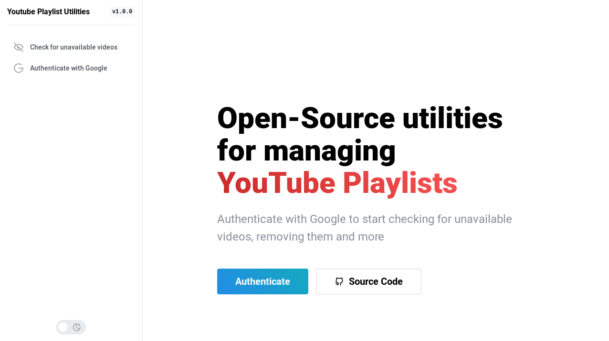
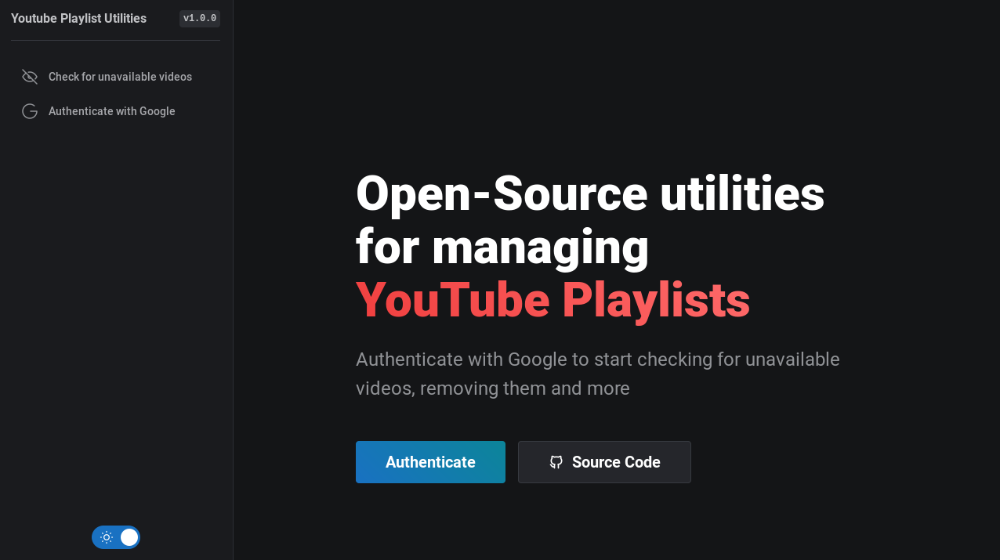

# YouTube Playlist Utilities

A simple playlist manager for YouTube.

This program is able to get all unavailable videos of a playlist, show them to the user and remove them from the playlist (if you are the owner). It was created because YouTube UI isn't very intuitive to tell you where are the unavailable videos - which can be a mess if your playlist is big enough (some of mine have 200+ videos).

## Requirements

- Node.js `18.17.1` or higher
- pnpm `8.6.5` or higher
- A Google OAuth Client ID

## Setup

1. Create a `.env` file in the repository root. It must have all the same environment variables as the `.env.example` file.
2. Edit the `VITE_GOOGLE_OAUTH_CLIENT_ID` variable to use your previously acquired Google OAuth Client ID.
3. Run the command `pnpm install` to install all dependencies
4. Run the command `pnpm tauri build` to generate a build
5. Use the generated binaries (console will show their path)

## License

[MIT](./LICENSE)
